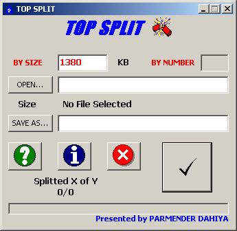



## A  \*\*\*\*\*\*  File Splitter

### Description

Need a file splitter? Here is the good one.(NO BUG FOUND/REPORTED IN ABOUT 4 YEARS) You can split any type of file with this. PLEASE VOTE FOR ME because this code shows how to write to files in binary mode and to make a batch file at run time. This program opens all the files in binary mode for reading, writing or appending. I have tried to remove almost every bug in it but if comes please feel free to notify me. In case you make any enhancements to it please let me know. Enjoy splitting....
 
### More Info
 
Splitted Files with extentions .0,.1, and so on and a batch file with original name of the splitted file.

             |
---                |---
**Submitted On**   |2002-11-28 15:28:18
**By**             |[Parmender Dahiya](https://github.com/Planet-Source-Code/PSCIndex/blob/master/ByAuthor/parmender-dahiya.md)
**Level**          |Intermediate
**User Rating**    |4.8 (86 globes from 18 users)
**Compatibility**  |VB 6\.0
**Category**       |[Files/ File Controls/ Input/ Output](https://github.com/Planet-Source-Code/PSCIndex/blob/master/ByCategory/files-file-controls-input-output__1-3.md)
**World**          |[Visual Basic](https://github.com/Planet-Source-Code/PSCIndex/blob/master/ByWorld/visual-basic.md)
**Archive File**   |[A\_\_\_\_\_\_\_\_\_153917242003\.zip](https://github.com/Planet-Source-Code/parmender-dahiya-a-file-splitter__1-38882/archive/master.zip)

